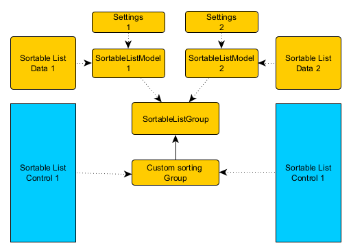
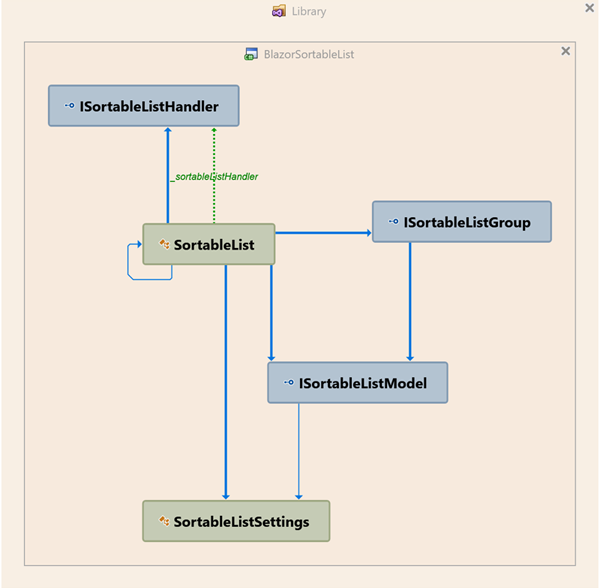
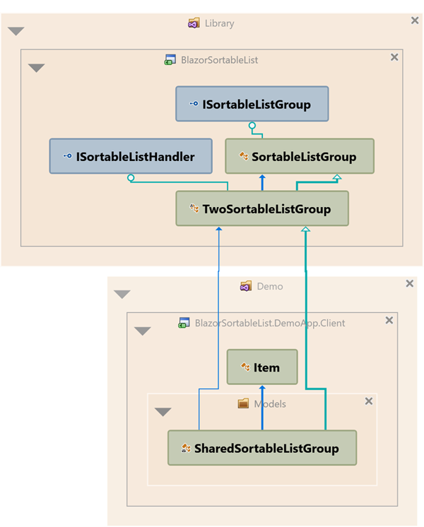
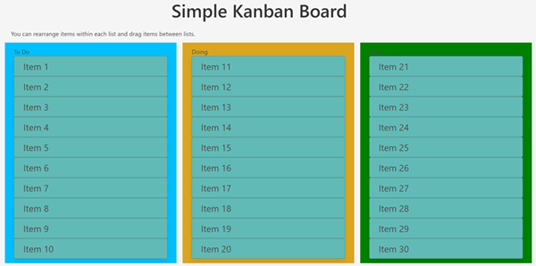
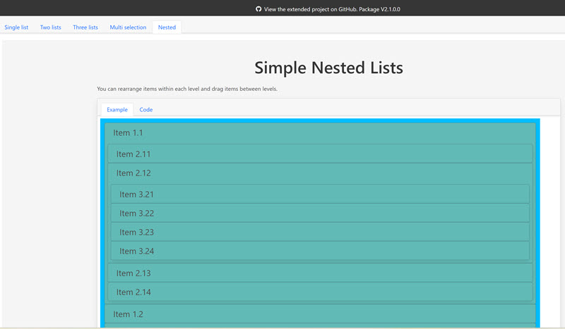

# Blazor Sortable List
## Overview
Fork an implementation of the [SortableJS library](https://sortablejs.github.io/Sortable/) for Blazor. This example shows you how to reorder elements within a list using drag and drop.

- [View Demos .NET7 web assembly](https://mango-flower-090e9130f.4.azurestaticapps.net/)
- [View Youtube demonstration](https://www.youtube.com/watch?v=DdsD1j8a-DA)

> Original JS library has more features as implemented now.  
> Current version supports one or two lists.

Great implementation, but I would like to make some changes:
- extract package (done).
- use .NET 8.0 project style for Demo application (done).
- I am thinking of an architecture/usability improvement (done).
- add support for multiple lists (done).
- implement some of the missing functionality from the JS library (multi selection added).

> The latest changes will appear first on the development branch.


Compare current implementation with original version (.NET 7):
- [View Demos .NET8 server prerendering](https://blazorsortablelistdemoapp2024.azurewebsites.net/)

>**Note**: If you are using two or more lists, and one of the lists is empty, then drop the item near the top of the empty list.

## Prerequisites

- [dotnet 8](https://dotnet.microsoft.com/download/dotnet/8.0)

## Running Locally

1. Clone this repository.
1. Run the project 'BlazorSortableList.DemoApp' 

## How to use it in your own project

1. **Install the latest NuGet Package**

 - Using Package Manager
```
Install-Package BlazorSortableList
```

 - Using .NET CLI
```
dotnet add package BlazorSortableList
```

 - Using MS VS Manage NuGet Packages search for `BlazorSortableList`

2. Add SortableJS to your `index.html`/`app.razor` file. You can either download from the [SortableJS website](https://sortablejs.github.io/Sortable/) or use a CDN...

 ```
<script src="https://cdn.jsdelivr.net/npm/sortablejs@latest/Sortable.min.js"></script>
 ```

3. Add the `SortableList.razor.js` to your `index.html`/`app.razor` file..

 ```
<script type="module" src="_content/BlazorSortableList/SortableList.razor.js"></script>
 ```

4a. [From version 1.2](https://github.com/AlexNek/BlazorSortableList#version-12), you can move all the logic out of the component and use the standard implementation of the logic (`SingleSortableListGroup`, ~~V1.2:`TwoSortableListGroup`~~, V2.0:`MultiSortableListGroup`).

*Razor*
```html
@using BlazorSortableList

<SortableList Id="@ListId" GroupModel="@_group" Context="item">
    <SortableItemTemplate>
       <p>@item.Name</p>
    </SortableItemTemplate>
</SortableList>
```
*Code behind*
```csharp
private const string ListId = "sortable";

private SingleSortableListGroup<Item> _group;

protected override async Task OnInitializedAsync()
{
      await base.OnInitializedAsync();

      _group = new SingleSortableListGroup<Item>(ListId, new SortableListModel<Item>(items));
}
```

4b. Or you can use the old style - Add the SortableList component to your page and define the SortableItemTemplate...
```html
@using BlazorSortableList
<SortableList Id="sortable" Items="items" OnUpdate="@SortList" Context="item">
     <SortableItemTemplate>
         <div>
             <p>@item.Name</p>
         </div>
     </SortableItemTemplate>
</SortableList>
```

 - ***Items***: The list of items to be displayed. Can be of any type.
 - ***OnUpdate***: The method to be called when the list is updated.
 - ***Context***: The name of the variable to be used in the template.

The `SortableItemTemplate` can contain any markup or components that you want. `SortList` implementation see below.

## Attributes

### Properties

All properties are optional and have default values.

| Name | Type | Default|Ver.|Description|
|------|------|--------|---|-----------|
|   Id   |  String|new GUID|1.0|The id of the HTML element that will be turned into a sortable list. If you don't supply this, a random id (GUID) will be generated for you|
|Group|String|new GUID|1.0|Used for dragging between lists. Set the group to the same value on both lists to enable|
|Pull|String|null|1.0|Used when you want to clone elments into a list instead of moving them. Set `Pull` to "clone"|
|Put|Boolean|true|1.0|Set to false to disable dropping from another list onto the current list|
|Sort|Boolean|true|1.0|Disable sorting within a list by setting to `false`|
|Handle|String|""|1.0|The CSS class you want the sortable to respect as the drag handle|
|Filter|String|""|1.0|The CSS class you want to use to identify elements that cannot be sorted or moved|
|ForceFallback|Boolean|true|1.0|Enable HTML5 drag and drop by setting to `false`|
|DefaultSort|Boolean|false|1.1|Enable simplified use by setting to `true`.|
|GroupModel|ISortableListGroup<T>|false|1.2|[Data management class](https://github.com/AlexNek/BlazorSortableList#version-12)|


> **Note:** Pay attention to the fact that you have to declare the handle in your code. You can only drag an item using the handle. 
> For this example, you need to set `Handle` to `.drag-handle`. 

  ``` html
    <div class="has-cursor-grab">
        <div class="drag-handle mr-4">
            <i class="is-size-4 fas fa-grip-vertical"></i>
        </div>
    </div>
  ```

### Events

`OnUpdate` (Optional): The method to be called when the list is updated. You can name this method whatever you like, but it expects a `oldIndex` and `newIndex` parameters when the drag and drop occurs.

`OnRemove` (Optional): The method to be called when an item is removed from a list. This method is useful for handling the drop even between multiple lists. Like `OnUpdate`, it expects `oldIndex` and `newIndex` parameters.

You will need to handle all events yourself. **If you don't handle any events, no sort or move will happen** as Blazor needs to make the changes to the underlying data structures so it can re-render the list. 

Here is an example of how to reorder your list when the OnUpdate is fired...

*Razor*
```html
<SortableList Id="simpleList" Items="items" OnUpdate="@SortList" Context="item">
    <SortableItemTemplate>
        <div class="card has-border-light has-background-blazor has-text-white has-cursor-grab">
            <p class="is-size-4 p-2 ml-4">@item.Name</p>
        </div>
    </SortableItemTemplate>
</SortableList>
```
*C#*
```csharp
private List<Item> items = Enumerable.Range(1, 10).Select(i => new Item { Id = i, Name = $"Item {i}" }).ToList();

private void SortList((int oldIndex, int newIndex) indices)
{
        var (oldIndex, newIndex) = indices;

        var items = this.items;
        var itemToMove = items[oldIndex];
        items.RemoveAt(oldIndex);

        if (newIndex < items.Count)
        {
            items.Insert(newIndex, itemToMove);
        }
        else
        {
            items.Add(itemToMove);
        }

        StateHasChanged();
}
```

## Enhanced version

### Version 1.1
From version 1.1 It is possible to use simplified code.

*Razor*
```html
<SortableList Items="items" Context="item" DefaultSort>
    <SortableItemTemplate>
        <div class="card has-border-light has-background-blazor has-text-white has-cursor-grab">
            <p class="is-size-4 p-2 ml-4">@item.Name</p>
        </div>
    </SortableItemTemplate>
</SortableList>
```
No additional C# code required.

### Version 1.2
I am trying to move all the logic to external classes because I want to use the dumb UI.

The main idea is that all lists in the group use the same "data" class. This class received all notifications and manipulated the real data elements (fig.1 - custom sorting group, fig.3 SharedSortableListGroup). Each list must have its own settings. Each list must have its own settings. Settings and data (fig.1 - SortableListModel) are accessible via list id. Make sure you use the same id for the list control and the data insert.
  
*fig.1*

  
*fig.2*

  
*fig.3*

You can now compare 2 implementations, old and new:  
*Razor*
```html
<SortableList Id="@ListId" GroupModel="@_group" Context="item">
    <SortableItemTemplate>
        <div class="card has-border-light has-background-blazor1 has-cursor-grab">
            <p class="is-size-4 p-2 ml-4">@item.Name</p>
        </div>
    </SortableItemTemplate>
</SortableList>
```
*C#*
```csharp
private const string ListId = "ExampleListId";
private List<Item> items = Enumerable.Range(1, 10).Select(i => new Item { Id = i, Name = $"Item {i}" }).ToList();

private SingleSortableListGroup<Item> _group;

protected override async Task OnInitializedAsync()
{
      await base.OnInitializedAsync();

      _group = new SingleSortableListGroup<Item>(ListId, new SortableListModel<Item>(items));
}
```
There are two default generic implementations, `SingleSortableListGroup` and `TwoSortableListGroup`.
Both implement standard operations for single list and group of two lists (see demo application for details).


### Version 2.0
#### Support for more than two lists
It is possible to use more than two lists.
  
I decided to replace the old `TwoSortableListGroup` class with the new `MultiSortableListGroup` class to provide that functionality.

```csharp
public class MultiSortableListGroup<T> : SortableListGroup<T>, ISortableListHandler
{

    protected MultiSortableListGroup(Action refreshComponent)
    {
    ...
    }

    public virtual bool HandleRemove(string fromId, string toId, int oldIndex, int newIndex)
    {
        ... call ListMoveItem()
    }

    public virtual bool HandleUpdate(string id, int oldIndex, int newIndex)
    {
        ... call ListArrangeItems()
    }

    protected virtual void ListMoveItem(int oldIndex, int newIndex, IList<T> items1, IList<T> items2)
    {
        ...
    }

    protected virtual void ListArrangeItems(int oldIndex, int newIndex, IList<T> items)
    {
        ....
    }
}
```
The default implementation of this class supports rearranging items for each class (`ListArrangeItems`) and moving items from one list to another (`ListMoveItem`).  
For special cases, you can override any function.

#### Multiple selection
If you need to move more than one item, this is also possible. You can find pictures and detailed description in section [Behaviour](https://github.com/SortableJS/Sortable/wiki/Dragging-Multiple-Items-in-Sortable). All selected items will be moved to the list at once, in their original list order, and the selected state will be cleared after the drop.
You can select and deselect items using the left mouse button by default. It is also possible to define an additional key (`AddToSelectionKey`) for multiple selection. In this case, it is possible to select an item with the mouse and it is possible to select another item by pressing the defined button.  
For using multiple selection there is a new support class: `MultiSelectionListGroup<T>` where T must be inherited from `ISelectableItem`.With this class, it is possible to use a single selection and a multiple selection with one or more lists.  

> **Note**: It is not so easy to synchronise JS and blazor state for multiple selection. So the selection will be cleared after you drop the selected items.
> Don't click too quickly when selecting. Under certain circumstances, the selection may be erased.

```csharp
public class Item : ISelectableItem
{
    public int Id { get; set; }

    public string Name { get; set; } = "";

    public bool Disabled { get; set; } = false;

    public bool Selected { get; set; } = false;
}

internal class CustomMultiSelectionListGroup : MultiSelectionListGroup<Item>
{
    public CustomMultiSelectionListGroup(Action refreshComponent)
        : base(refreshComponent)
    {
    }
}
```
### Version 2.1  

Support for nested lists added.  
  

*Razor*
```html
<SortableList Id="@ListIdRoot" GroupModel="@_group" Context="item">
    <SortableItemTemplate>
        <SortableListNested NestedIdPrefix="@ListIdNested" Item="item" GroupModel="@_group" />
    </SortableItemTemplate>
</SortableList>
```  
*Code behind*
```csharp
private const string ListIdRoot = "NestedListIdRoot";
private const string ListIdNested = "NestedListId";
private const string GroupId = "BoardGroup";

public List<NestedItem> rootItems = Enumerable.Range(1, 5).Select(i => new NestedItem { Id = i, Name = $"Item 1.{i}" }).ToList();

public List<NestedItem> items2 = Enumerable.Range(11, 4).Select(i => new NestedItem { Id = i, Name = $"Item 2.{i}" }).ToList();
public List<NestedItem> items3 = Enumerable.Range(21, 4).Select(i => new NestedItem { Id = i, Name = $"Item 3.{i}" }).ToList();
public List<NestedItem> items4 = Enumerable.Range(31, 4).Select(i => new NestedItem { Id = i, Name = $"Item 4.{i}" }).ToList();

NestedSortableListGroup _group;

protected override async Task OnInitializedAsync()
{
    await base.OnInitializedAsync();
    _group = new NestedSortableListGroup(() => StateHasChanged());
    items2[1].Children = items3;
    rootItems[0].Children = items2;
    rootItems[3].Children = items4;
    var settings = new SortableListSettings() { FallbackOnBody = true, SwapThreshold = 0.65 };

    _group.AddModel(ListIdRoot, new SortableListModel<NestedItem>(rootItems) { Group = GroupId, Settings = settings });
    foreach (var item in rootItems)
    {
        if (item.Children != null)
        {
            AddNestedModel(item, settings);
        }
    }
}

private void AddNestedModel(NestedItem item, SortableListSettings settings)
{
    if (item.Children != null)
    {
        _group.AddModel($"{ListIdNested}{item.Id}", new SortableListModel<NestedItem>(item.Children) { Group = GroupId, Settings = settings });
        foreach (var child in item.Children)
        {
            if (child.Children != null)
            {
                AddNestedModel(child, settings);
            }
        }
    }
}
```
>**Note:** The *SortableListNested* component must be copied from the sample project and modified to suit your needs.

---

### Properties of the `SortableListSettings` Class
How to use settings in Dumb UI mode.  
*Razor*
```html
<SortableList Id="MyListId" GroupModel="@_group" Context="item">
    <SortableItemTemplate>
        <div class="has-background-blazor has-cursor-grab">
            <p>@item.Name</p>
        </div>
    </SortableItemTemplate>
</SortableList>
```
*Code behind*
```csharp
MySortableListGroup _group;

protected override async Task OnInitializedAsync()
{
    await base.OnInitializedAsync();

    SortableListSettings settings = new SortableListSettings() { CloneMode = true };
    _group = new MySortableListGroup(ListId1, ListId2, () => StateHasChanged());
    _group.AddModel(ListId1, new SortableListModel<Item>(items1) { Group = GroupId, Settings = settings });
    _group.AddModel(ListId2, new SortableListModel<Item>(items2) { Group = GroupId, Settings = settings });
}
```

Table of all the settings you can make:


|Name| Similar name for Component | Type | Default|Ver.|Description|
|---|------|------|--------|---|-----------|
|CloneMode|Pull|Boolean|false|1.2|Used when you want to clone elments into a list instead of moving them. |
|AllowDrop|Put|Boolean|true|1.2|Set to false to disable dropping from another list onto the current list|
|AllowReorder|Sort|Boolean|true|1.2|Disable sorting within a list by setting to `false`|
|CssForDragHandle|Handle|String|""|1.2|The CSS class you want the sortable to respect as the drag handle|
|CssForDisabledItem|Filter|String|""|1.2|The CSS class you want to use to identify elements that cannot be sorted or moved|
|AllowHtml5DragAndDrop|ForceFallback|Boolean|false|1.2|Enable HTML5 drag and drop |
|MultiSelection|-|boolean|false|2.0|Enable mutiple selection|
|AddToSelectionKey|-|string|null|2.0|Define custom key for mutiple selection|
|AvoidImplicitDeselect|-|boolean|false|2.0|By default, if you press outside the list box, the selection is removed. To prevent this, set it to true|
|AvoidImplicitDeselect|-|boolean|false|2.1|True indicating whether appends the cloned DOM Element into the Document's Body allowed|
|SwapThreshold|-|double|1.0|2.1|Threshold of the swap zone


## Update Notes
Sometimes, when updating the software, the browser used an old version of JavaScript from the cache.
If you see any exceptions or the demo application doesn't work for you, try opening the Browser Developer Console/Network tab. Then select "Disable Cache" and refresh the page.

## History
V2.1 - added support of nested lists.
V2.0 - **Breaking changes!** Added support for multiple lists. Multiple selections possible too.  
V1.2 - addition of data abstraction classes  
V1.1 - added DefaultSort parameter  
V1.0 - orignal component